# Flink SQL 字段级血缘：Flink 2.1 Listener + Planner Replay

```mermaid
flowchart LR
    A["K8s / Flink 2.1 SQL 任务"] --> B["Flink JobStatusChangedListener"]
    B --> C["JobCreatedEvent#lineageGraph()"]
    C --> D["提取 inputs / outputs / schema / connector options"]
    D --> E{"是否配置 collector.url"}
    E -->|是| F["POST /lineage-events/flink2.1"]
    E -->|否| G["写入 /tmp/flink21-lineage-events.jsonl"]
    G --> H["本地回放脚本"]
    F --> I["生成临时 CREATE TABLE DDL"]
    H --> I
    I --> J["注册到 flink-sql-lineage Flink 2.1 Catalog"]
    J --> K["创建任务并写入 Flink SQL"]
    K --> L["lineage-flink2.1.x 重新跑 Flink Planner"]
    L --> M["RelNode + Flink RelMetadataQuery"]
    M --> N["字段级血缘图"]
```



## 这个项目现在解决什么问题

你的生产环境里已经在 K8s 上跑了很多 Flink SQL 任务。你能拿到 SQL，也能通过 Flink 2.1 的 listener 拿到 source/sink schema。这个项目现在的目标是把这两类信息合起来：

```text
SQL + listener schema -> flink-sql-lineage 重新跑 Flink Planner -> 字段级血缘
```

这里最关键的一点是：**Flink listener 不直接产出字段级血缘**。Flink 2.x 原生 lineage API 给的是运行时数据集、表级关系和 schema 上下文。字段级血缘仍然要让 `flink-sql-lineage` 用相同 schema 重新跑 Flink planner，再从 `RelNode` 和 Flink metadata provider 里算出来。

## 模块说明

```text
lineage-flink2.1-listener
  Flink 2.1 JobStatusChangedListener。采集 JobCreatedEvent#lineageGraph()，可写 JSONL，也可 POST 到服务端 collector。

lineage-flink2.1.x
  Flink 2.1 planner 插件。负责 parse、validate、convert、RelNode、字段级血缘计算。

lineage-server
  后端服务。保存 catalog/table/task/lineage，并提供 collector 接口。

lineage-web
  前端页面。展示任务列表和字段级血缘图。
```

本仓库只提交 listener 源码、服务端代码、脚本和文档。**不提交本地 Flink 整包**。本地 Flink 发行包默认放在：

```text
~/software/flink/flink-2.1.0
```

## OpenLineage 对齐关系

OpenLineage Flink 2.x 也是走这条主链路：

```text
execution.job-status-changed-listeners
  -> JobStatusChangedListenerFactory
  -> JobCreatedEvent#lineageGraph()
  -> LineageGraph
  -> inputs / outputs
```

它的源码在 OpenLineage 仓库的 `integration/flink/flink2` 目录。核心类包括：

```text
OpenLineageJobStatusChangedListenerFactory
OpenLineageJobStatusChangedListener
LineageGraphConverter
OpenLineageDatasetExtractor
TableLineageDatasetWrapper
```

我们对齐了最关键的 Flink 2.x 获取链路，尤其是 `TableLineageDataset.table()` 这一点。Table SQL 场景下，`LineageDataset.facets()` 可能没有 schema，OpenLineage 会识别 Flink planner 内部的 `TableLineageDataset`，通过反射调用 `table()` 拿 `CatalogBaseTable`，再读 `getUnresolvedSchema()`。本项目 listener 也用了同样方式。

差异是：

```text
OpenLineage:
  Flink event -> OpenLineage RunEvent -> Marquez/DataHub/collector

本项目:
  Flink event -> schema + SQL -> flink-sql-lineage -> 字段级血缘图
```

所以不用把 OpenLineage 的完整实现照搬过来。它的大量代码用于通用事件标准、transport、facet、checkpoint、detached job tracking、Kafka/JDBC identifier 等能力；我们当前先保留和字段级 SQL 血缘闭环直接相关的部分。

参考：

- [OpenLineage Flink 2.x 文档](https://openlineage.io/docs/integrations/flink/flink2/)
- [OpenLineage Flink 2.x 源码目录](https://github.com/OpenLineage/OpenLineage/tree/main/integration/flink/flink2)
- [Flink Job Status Changed Listener](https://nightlies.apache.org/flink/flink-docs-stable/docs/deployment/advanced/job_status_listener/)

## 本地快速启动

### 1. 构建后端、Flink 2.1 planner 插件和 listener

```bash
cd /Users/xujiawei/magic/workbench/flink-sql-lineage

JAVA_HOME=$(/usr/libexec/java_home -v 17) \
/Users/xujiawei/software/apache-maven-3.8.8/bin/mvn \
  -pl lineage-flink2.1.x,lineage-flink2.1-listener,lineage-client,lineage-server/lineage-server-start \
  -am \
  -DskipTests \
  -Dprofile.active=test \
  package
```

产物：

```text
lineage-client/target/plugins/flink2.1.x
lineage-flink2.1-listener/target/lineage-flink2.1-listener-1.0.0.jar
lineage-server/lineage-server-start/target/lineage-server-1.0.0.jar
```

### 2. 启动后端

H2 快速启动：

```bash
scripts/dev/start-backend.sh
```

MySQL 启动：

```bash
scripts/dev/start-backend-mysql.sh
```

默认本地账号：

```text
admin / admin
```

### 3. 启动前端

```bash
scripts/dev/start-web.sh
```

打开：

```text
http://127.0.0.1:3001/#/job/list
```

## 本地实验：JSONL 回放模式

这个模式最适合手动复现和排查问题。

```bash
cd /Users/xujiawei/magic/workbench/flink-sql-lineage

lineage-flink2.1-listener/scripts/02_安装到Flink.sh
lineage-flink2.1-listener/scripts/03_配置Flink.sh
lineage-flink2.1-listener/scripts/04_启动Flink.sh
lineage-flink2.1-listener/scripts/05_提交演示任务.sh
lineage-flink2.1-listener/scripts/06_回放到血缘服务.py
```

也可以一键执行：

```bash
lineage-flink2.1-listener/scripts/07_一键重现实验.sh
```

成功后会创建 `监听器回放-*` 任务，并在前端看到：

```text
listener_ods_user.id       -> listener_dwd_user.id
listener_ods_user.name     -> listener_dwd_user.name_upper       UPPER(name)
listener_ods_user.birthday -> listener_dwd_user.birthday_day     DATE_FORMAT(birthday, 'yyyyMMdd')
listener_ods_user.score    -> listener_dwd_user.score_text       CAST(score AS STRING)
```

## 本地实验：HTTP Collector 模式

这个模式更接近生产链路。listener 不只写 JSONL，还会直接把事件 POST 给 `lineage-server`：

```bash
LINEAGE_COLLECTOR_URL=http://127.0.0.1:8194/lineage-events/flink2.1 \
LINEAGE_COLLECTOR_USERNAME=admin \
LINEAGE_COLLECTOR_PASSWORD=admin \
lineage-flink2.1-listener/scripts/03_配置Flink.sh
```

然后重启 Flink 并提交 demo：

```bash
lineage-flink2.1-listener/scripts/08_停止Flink.sh
lineage-flink2.1-listener/scripts/04_启动Flink.sh
lineage-flink2.1-listener/scripts/05_提交演示任务.sh
```

listener 默认会读取：

```text
lineage-flink2.1-listener/sql/listener-insert.sql
```

并把 SQL、jobId、jobName、input/output schema 一起上报给：

```text
POST /lineage-events/flink2.1
```

服务端 collector 会做：

```text
1. 从 listener event 取 inputs/outputs schema
2. 生成 CREATE TABLE IF NOT EXISTS
3. 注册表到 Flink 2.1 memory catalog
4. 创建 task
5. 写入 listener-insert.sql 里的 INSERT SQL
6. 调用现有 /tasks/{taskId}/lineage 逻辑
7. 保存字段级血缘图
```

这里故意把 SQL 分成两个文件：

```text
listener-demo.sql
  给 Flink SQL Client / demo job 使用，包含 CREATE TABLE + INSERT。

listener-insert.sql
  给 flink-sql-lineage planner replay 使用，只包含 INSERT。
  因为表 schema 已经从 listener event 自动注册，不需要在任务 SQL 里重复 CREATE TABLE。
```

## 生产接入建议

在 K8s Flink 集群里，建议这样接：

```text
Flink SQL 发布系统
  保存 SQL、jobName、业务任务 id

Flink 2.1 集群
  安装 lineage-flink2.1-listener jar
  配置 execution.job-status-changed-listeners
  配置 lineage.collector.url

flink-sql-lineage server
  接收 /lineage-events/flink2.1
  用 listener schema + SQL 重跑 planner
  保存字段级血缘
```

如果 SQL 不方便直接写进 Flink config，可以在你们发布系统里做一层 collector：

```text
listener 上报 jobId/schema
发布系统按 jobId 找 SQL
再调用 flink-sql-lineage collector
```

## 为什么不能只用 Calcite

直接用 Calcite 通常只到 `SqlNode`，也就是语法树。字段级血缘需要 Flink 语义信息：

```text
catalog / database / table
source schema / sink schema
function / UDF
connector / computed column / watermark
Flink SQL dialect
Flink planner metadata provider
```

所以本项目走的是 Flink 自己的 planner：

```text
SQL
  -> Flink parser
  -> validate
  -> Operation
  -> SinkModifyOperation
  -> PlannerQueryOperation
  -> RelNode
  -> FlinkDefaultRelMetadataProvider
  -> RelMetadataQuery#getColumnOrigins
```

这就是为什么你自己只用 Calcite parse SQL 时会卡在 schema 或 `RelNode`：没有 schema/catalog，就没法完成 validate；没有 Flink metadata provider，就算有 RelNode 也很难拿到正确字段来源。

## 常用命令

编译 listener：

```bash
lineage-flink2.1-listener/scripts/01_编译监听器.sh
```

停止本地 Flink：

```bash
lineage-flink2.1-listener/scripts/08_停止Flink.sh
```

诊断任务：

```bash
curl -u admin:admin -X POST http://127.0.0.1:8194/tasks/<taskId>/diagnostic
```

清理旧 Flink 1.x 数据：

```bash
mysql -h <host> -P <port> -u <user> -p < scripts/mysql/cleanup_old_flink.sql
```
