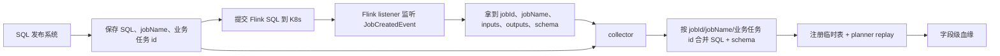
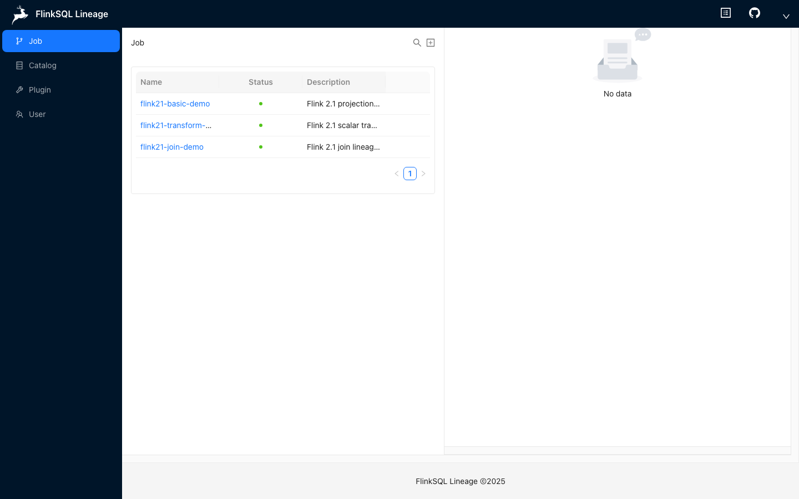
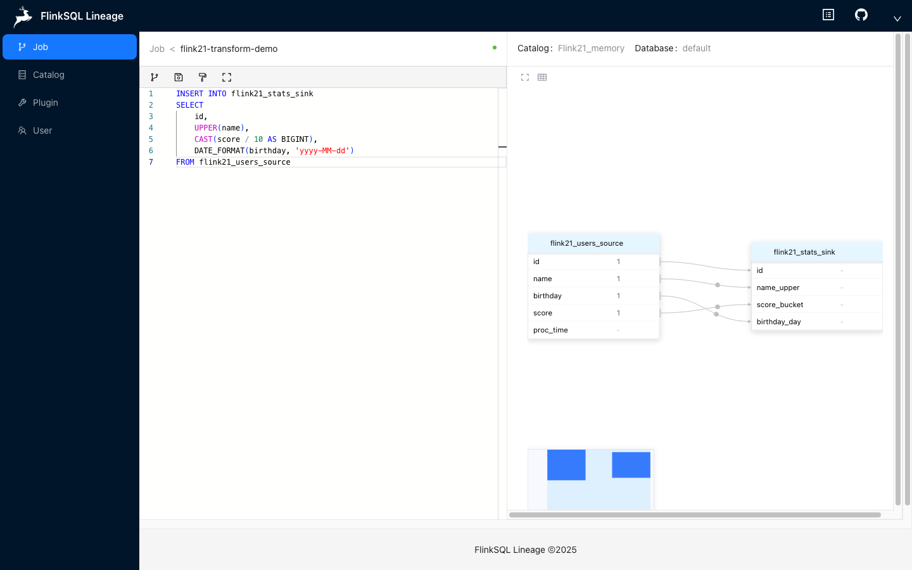
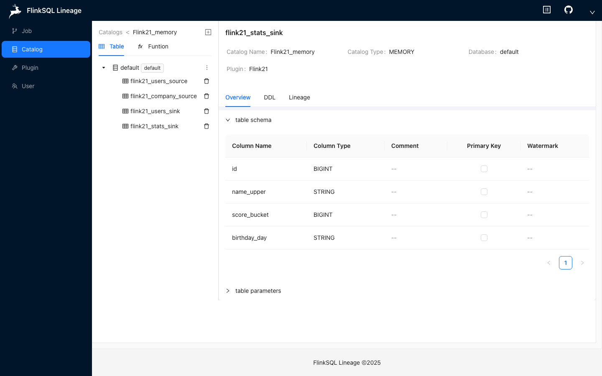
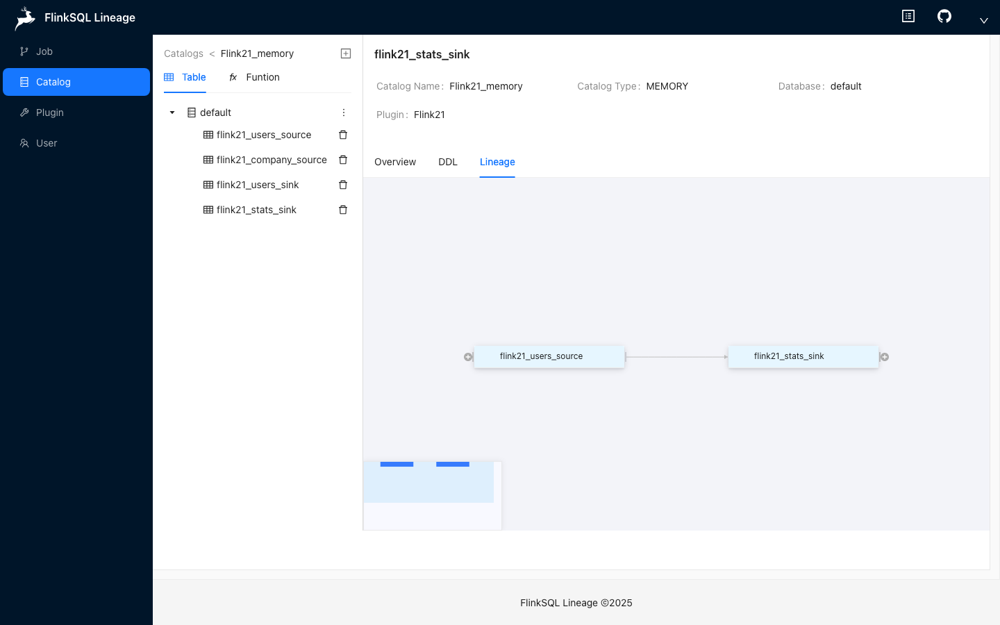

# Flink SQL 字段级血缘：Flink 2.1 Listener + Planner Replay

```mermaid
flowchart LR
    A["本地 / K8s 提交 Flink SQL"] --> B["Flink 2.1 作业启动"]
    A --> S["SQL 来源"]
    S --> S1["实验模式: lineage.collector.sql-file"]
    S --> S2["生产模式: SQL 发布系统按 jobId/jobName 补齐"]
    B --> C["Flink JobStatusChangedListener"]
    C --> D["JobCreatedEvent#lineageGraph()"]
    D --> E["提取 inputs / outputs / schema / connector options"]
    E --> F["Listener event"]
    S1 --> F
    S2 --> F
    F --> G{"是否配置 collector.url"}
    G -->|是| H["POST /lineage-events/flink2.1"]
    G -->|否| I["写入 /tmp/flink21-lineage-events.jsonl"]
    I --> J["本地回放脚本补 SQL"]
    H --> K["生成临时 CREATE TABLE DDL"]
    J --> K
    K --> L["注册到 flink-sql-lineage Flink 2.1 Catalog"]
    L --> M["创建任务并写入 Flink SQL"]
    M --> N["lineage-flink2.1.x 重新跑 Flink Planner"]
    N --> O["RelNode + Flink RelMetadataQuery"]
    O --> P["字段级血缘图"]
```



## 这个项目现在解决什么问题

你的生产环境里已经在 K8s 上跑了很多 Flink SQL 任务。你能拿到 SQL，也能通过 Flink 2.1 的 listener 拿到 source/sink schema。这个项目现在的目标是把这两类信息合起来：

```text
SQL + listener schema -> flink-sql-lineage 重新跑 Flink Planner -> 字段级血缘
```

这里最关键的一点是：**Flink listener 不直接产出字段级血缘**。Flink 2.x 原生 lineage API 给的是运行时数据集、表级关系和 schema 上下文。字段级血缘仍然要让 `flink-sql-lineage` 用相同 schema 重新跑 Flink planner，再从 `RelNode` 和 Flink metadata provider 里算出来。

## SQL 是怎么传过去的

这一点评审时一定要讲清楚：**Flink 2.1 listener 负责拿 schema，不负责可靠地还原原始 SQL**。

Flink 2.1 的 `JobCreatedEvent#lineageGraph()` 能拿到：

```text
jobId / jobName
inputs / outputs
source table schema
sink table schema
connector options
source -> sink 的表级关系
```

但字段级血缘 replay 还需要原始 `INSERT SQL`。所以当前设计把 SQL 当成另一条输入：

```text
schema 来自 Flink listener
SQL 来自提交系统 / 配置文件 / 回放脚本
schema + SQL 一起进入 flink-sql-lineage collector
```

### 本地实验里 SQL 怎么传

本地实验通过 Flink 配置把 SQL 文件路径传给 listener：

```yaml
execution.job-status-changed-listeners: com.hw.lineage.flink.listener.Flink21LineageListenerFactory
lineage.collector.url: http://127.0.0.1:8194/lineage-events/flink2.1
lineage.collector.catalog-id: 1
lineage.collector.database: default
lineage.collector.sql-file: /Users/xujiawei/magic/workbench/flink-sql-lineage/lineage-flink2.1-listener/sql/listener-insert.sql
```

代码位置：

```text
lineage-flink2.1-listener/src/main/java/com/hw/lineage/flink/listener/Flink21LineageListenerFactory.java
```

listener 启动时会读取：

```text
lineage.collector.sql
lineage.collector.sql-file
```

如果 `lineage.collector.sql` 为空，就读取 `lineage.collector.sql-file`。随后在 `JobCreatedEvent` 到来时，它把 SQL 塞进同一个 JSON payload：

```json
{
  "eventType": "JobCreatedEvent",
  "jobId": "...",
  "jobName": "...",
  "catalogId": 1,
  "database": "default",
  "sql": "INSERT INTO flink21_stats_sink SELECT ...",
  "inputs": [
    {
      "name": "Flink21_memory.default.flink21_users_source",
      "schema": [
        {"name": "id", "type": "BIGINT"},
        {"name": "name", "type": "STRING"}
      ]
    }
  ],
  "outputs": [
    {
      "name": "Flink21_memory.default.flink21_stats_sink",
      "schema": [
        {"name": "id", "type": "BIGINT"},
        {"name": "name_upper", "type": "STRING"}
      ]
    }
  ]
}
```

然后 listener 直接发给：

```text
POST /lineage-events/flink2.1
```

如果没有配置 `lineage.collector.url`，listener 只把同样的事件写入：

```text
/tmp/flink21-lineage-events.jsonl
```

这时由本地回放脚本读取 JSONL 里的 schema，再读取 `listener-insert.sql`，组合后调用后端接口：

```text
lineage-flink2.1-listener/scripts/06_回放到血缘服务.py
```

### 服务端收到后怎么走下一步

服务端入口：

```text
POST /lineage-events/flink2.1
```

核心实现：

```text
lineage-server/lineage-server-application/src/main/java/com/hw/lineage/server/application/service/impl/LineageCollectServiceImpl.java
```

服务端收到 payload 后做 4 件事：

```text
1. 从 inputs / outputs 的 schema 生成 CREATE TABLE IF NOT EXISTS DDL
2. 调用 CatalogService.createTable，把 source/sink 表注册到 Flink21_memory catalog
3. 创建 task，把 payload.sql Base64 后写入 task_source
4. 调用 analyzeTaskLineage(taskId)，重新跑 Flink 2.1 planner，生成字段级血缘
```

也就是：

```text
listener event schema
  -> CREATE TABLE

payload.sql
  -> task_source
  -> /tasks/{taskId}/lineage
  -> Flink planner replay
```

### 生产环境建议怎么传 SQL

生产上不要依赖 Flink listener 自己“猜 SQL”。更稳的方式是接入你们的 Flink SQL 发布系统：



推荐落地方式：

```text
1. 发布系统提交 SQL 前，先保存 SQL、jobName、业务任务 id。
2. Flink listener 上报 jobId、jobName、schema、inputs、outputs。
3. collector 按 jobName 或业务任务 id 找到原始 SQL。
4. collector 调用 flink-sql-lineage 的 collector/analyze 流程。
```

这样 SQL 来源清晰，也能解决一个 Flink 作业里 SQL 太长、SQL 被平台改写、或者 SQL 不适合放进 Flink config 的问题。

## 评审演示示例：flink21_stats_sink

评审时可以用远端演示环境直接讲这条链路：

```text
http://106.55.92.13:3001/
```

演示任务选择 `flink21-transform-demo`，它的目标表是 `flink21_stats_sink`，SQL 如下：

```sql
INSERT INTO flink21_stats_sink
SELECT
    id,
    UPPER(name),
    CAST(score / 10 AS BIGINT),
    DATE_FORMAT(birthday, 'yyyy-MM-dd')
FROM flink21_users_source
```

这个例子能展示 4 条字段级血缘：

```text
flink21_users_source.id       -> flink21_stats_sink.id
flink21_users_source.name     -> flink21_stats_sink.name_upper       UPPER(name)
flink21_users_source.score    -> flink21_stats_sink.score_bucket     CAST(score / 10 AS BIGINT)
flink21_users_source.birthday -> flink21_stats_sink.birthday_day     DATE_FORMAT(birthday, 'yyyy-MM-dd')
```

### 1. 打开任务列表

打开 `Job` 页面，可以看到当前 Flink 2.1 的 3 个 demo 任务：

```text
http://106.55.92.13:3001/#/job/list
```



### 2. 查看任务 SQL 和字段血缘

点击 `flink21-transform-demo`，进入任务详情页。左侧是原始 SQL，右侧是基于 Flink 2.1 planner replay 算出来的字段级血缘图：

```text
http://106.55.92.13:3001/#/job/sql/2
```

如果右侧血缘图为空，可以点击任务页上方的血缘分析按钮，或者直接调用：

```bash
curl -X POST http://106.55.92.13:3001/tasks/2/lineage
```



### 3. 查看目标表 schema

进入 `Catalog -> Flink21_memory -> default -> flink21_stats_sink`，可以看到 listener/schema 注册后的目标表字段：

```text
http://106.55.92.13:3001/#/catalog/1/default/table/flink21_stats_sink
```



### 4. 查看表级入口的血缘

在同一个表详情页点击 `Lineage`，可以从 Catalog 表入口反查这张表的上下游。这个页面读取的是已经保存的任务血缘；如果某个任务还没分析过，表级入口会先显示空图，不会报错。



### 5. 评审时要讲清楚的结论

这个例子说明的是：

```text
1. 只用 Calcite/Flink parser 只能 parse SQL，拿不到可靠字段血缘。
2. 字段级血缘需要 schema，schema 可以来自手动录入，也可以来自 Flink 2.1 listener。
3. 服务端拿到 SQL + schema 后，会注册临时 Catalog/Table，再重新跑 Flink planner。
4. planner 产生 RelNode，项目再用 Flink metadata 计算 source column -> target column。
5. 最终结果既能在 Job 维度展示，也能从 Catalog 表维度反查。
```

## 模块说明

```text
lineage-flink2.1-listener
  Flink 2.1 JobStatusChangedListener。采集 JobCreatedEvent#lineageGraph()，可写 JSONL，也可 POST 到服务端 collector。

lineage-flink2.1.x
  Flink 2.1 planner 插件。负责 parse、validate、convert、RelNode、字段级血缘计算。

lineage-server
  后端服务。保存 catalog/table/task/lineage，并提供 collector 接口。

lineage-web
  前端页面。展示任务列表和字段级血缘图。
```

本仓库只提交 listener 源码、服务端代码、脚本和文档。**不提交本地 Flink 整包**。本地 Flink 发行包默认放在：

```text
~/software/flink/flink-2.1.0
```

## OpenLineage 对齐关系

OpenLineage Flink 2.x 也是走这条主链路：

```text
execution.job-status-changed-listeners
  -> JobStatusChangedListenerFactory
  -> JobCreatedEvent#lineageGraph()
  -> LineageGraph
  -> inputs / outputs
```

它的源码在 OpenLineage 仓库的 `integration/flink/flink2` 目录。核心类包括：

```text
OpenLineageJobStatusChangedListenerFactory
OpenLineageJobStatusChangedListener
LineageGraphConverter
OpenLineageDatasetExtractor
TableLineageDatasetWrapper
```

我们对齐了最关键的 Flink 2.x 获取链路，尤其是 `TableLineageDataset.table()` 这一点。Table SQL 场景下，`LineageDataset.facets()` 可能没有 schema，OpenLineage 会识别 Flink planner 内部的 `TableLineageDataset`，通过反射调用 `table()` 拿 `CatalogBaseTable`，再读 `getUnresolvedSchema()`。本项目 listener 也用了同样方式。

差异是：

```text
OpenLineage:
  Flink event -> OpenLineage RunEvent -> Marquez/DataHub/collector

本项目:
  Flink event -> schema + SQL -> flink-sql-lineage -> 字段级血缘图
```

所以不用把 OpenLineage 的完整实现照搬过来。它的大量代码用于通用事件标准、transport、facet、checkpoint、detached job tracking、Kafka/JDBC identifier 等能力；我们当前先保留和字段级 SQL 血缘闭环直接相关的部分。

参考：

- [OpenLineage Flink 2.x 文档](https://openlineage.io/docs/integrations/flink/flink2/)
- [OpenLineage Flink 2.x 源码目录](https://github.com/OpenLineage/OpenLineage/tree/main/integration/flink/flink2)
- [Flink Job Status Changed Listener](https://nightlies.apache.org/flink/flink-docs-stable/docs/deployment/advanced/job_status_listener/)

## 本地快速启动

### 1. 构建后端、Flink 2.1 planner 插件和 listener

```bash
cd /Users/xujiawei/magic/workbench/flink-sql-lineage

JAVA_HOME=$(/usr/libexec/java_home -v 17) \
/Users/xujiawei/software/apache-maven-3.8.8/bin/mvn \
  -pl lineage-flink2.1.x,lineage-flink2.1-listener,lineage-client,lineage-server/lineage-server-start \
  -am \
  -DskipTests \
  -Dprofile.active=test \
  package
```

产物：

```text
lineage-client/target/plugins/flink2.1.x
lineage-flink2.1-listener/target/lineage-flink2.1-listener-1.0.0.jar
lineage-server/lineage-server-start/target/lineage-server-1.0.0.jar
```

### 2. 启动后端

H2 快速启动：

```bash
scripts/dev/start-backend.sh
```

MySQL 启动：

```bash
scripts/dev/start-backend-mysql.sh
```

默认本地账号：

```text
admin / admin
```

### 3. 启动前端

```bash
scripts/dev/start-web.sh
```

打开：

```text
http://127.0.0.1:3001/#/job/list
```

## 本地实验：JSONL 回放模式

这个模式最适合手动复现和排查问题。

```bash
cd /Users/xujiawei/magic/workbench/flink-sql-lineage

lineage-flink2.1-listener/scripts/02_安装到Flink.sh
lineage-flink2.1-listener/scripts/03_配置Flink.sh
lineage-flink2.1-listener/scripts/04_启动Flink.sh
lineage-flink2.1-listener/scripts/05_提交演示任务.sh
lineage-flink2.1-listener/scripts/06_回放到血缘服务.py
```

也可以一键执行：

```bash
lineage-flink2.1-listener/scripts/07_一键重现实验.sh
```

成功后会创建 `监听器回放-*` 任务，并在前端看到：

```text
listener_ods_user.id       -> listener_dwd_user.id
listener_ods_user.name     -> listener_dwd_user.name_upper       UPPER(name)
listener_ods_user.birthday -> listener_dwd_user.birthday_day     DATE_FORMAT(birthday, 'yyyyMMdd')
listener_ods_user.score    -> listener_dwd_user.score_text       CAST(score AS STRING)
```

## 本地实验：HTTP Collector 模式

这个模式更接近生产链路。listener 不只写 JSONL，还会直接把事件 POST 给 `lineage-server`：

```bash
LINEAGE_COLLECTOR_URL=http://127.0.0.1:8194/lineage-events/flink2.1 \
LINEAGE_COLLECTOR_USERNAME=admin \
LINEAGE_COLLECTOR_PASSWORD=admin \
lineage-flink2.1-listener/scripts/03_配置Flink.sh
```

然后重启 Flink 并提交 demo：

```bash
lineage-flink2.1-listener/scripts/08_停止Flink.sh
lineage-flink2.1-listener/scripts/04_启动Flink.sh
lineage-flink2.1-listener/scripts/05_提交演示任务.sh
```

listener 默认会读取：

```text
lineage-flink2.1-listener/sql/listener-insert.sql
```

并把 SQL、jobId、jobName、input/output schema 一起上报给：

```text
POST /lineage-events/flink2.1
```

服务端 collector 会做：

```text
1. 从 listener event 取 inputs/outputs schema
2. 生成 CREATE TABLE IF NOT EXISTS
3. 注册表到 Flink 2.1 memory catalog
4. 创建 task
5. 写入 listener-insert.sql 里的 INSERT SQL
6. 调用现有 /tasks/{taskId}/lineage 逻辑
7. 保存字段级血缘图
```

这里故意把 SQL 分成两个文件：

```text
listener-demo.sql
  给 Flink SQL Client / demo job 使用，包含 CREATE TABLE + INSERT。

listener-insert.sql
  给 flink-sql-lineage planner replay 使用，只包含 INSERT。
  因为表 schema 已经从 listener event 自动注册，不需要在任务 SQL 里重复 CREATE TABLE。
```

## 生产接入建议

在 K8s Flink 集群里，建议这样接：

```text
Flink SQL 发布系统
  保存 SQL、jobName、业务任务 id

Flink 2.1 集群
  安装 lineage-flink2.1-listener jar
  配置 execution.job-status-changed-listeners
  配置 lineage.collector.url

flink-sql-lineage server
  接收 /lineage-events/flink2.1
  用 listener schema + SQL 重跑 planner
  保存字段级血缘
```

如果 SQL 不方便直接写进 Flink config，可以在你们发布系统里做一层 collector：

```text
listener 上报 jobId/schema
发布系统按 jobId 找 SQL
再调用 flink-sql-lineage collector
```

## 当前评估和设计方案

当前项目已经证明 Flink 2.1 字段级血缘方案可行：Flink listener 负责拿运行时 schema，`flink-sql-lineage` 负责用 schema + SQL 重新跑 Flink planner，最终生成字段级血缘。它适合作为生产血缘系统的基础，但 collector、SQL 关联、幂等、诊断和真实任务回归还需要继续生产化。

### 优点

1. 技术路线正确。

   项目没有停留在 SQL 文本解析，而是走 Flink 自己的 planner 链路：

   ```text
   SQL + schema
     -> Flink Parser
     -> Validate
     -> Operation
     -> RelNode
     -> RelMetadataQuery
     -> 字段级血缘
   ```

   这比单独使用 Calcite 更适合 Flink SQL 场景，尤其是函数、类型、connector、catalog、computed column、watermark 等 Flink 语义。

2. 能解决“只有 SQL、没有 schema”的核心卡点。

   单独靠 SQL 无法完成语义校验。现在通过 Flink 2.1 listener 可以拿到 source/sink schema，再把 schema 回放注册到 `flink-sql-lineage`，让 planner 重新分析 SQL。

3. Flink 2.1 闭环已经跑通。

   当前已经具备：

   ```text
   Flink 2.1 Listener
   JSONL 本地回放
   HTTP Collector
   Flink 2.1 Planner 插件
   后端任务分析
   前端字段级血缘展示
   ```

4. 适合接入已有 K8s Flink SQL 任务。

   如果生产环境已经运行大量 Flink SQL 任务，可以通过 listener 在任务创建时采集 schema，再由发布系统补充 SQL，最终进入血缘服务分析。

5. 维护复杂度下降。

   项目现在只保留 Flink 2.1，删除 Flink 1.14 / 1.16 后，依赖、插件、测试和兼容性负担明显下降。

### 缺点和风险

1. SQL 和 listener event 的关联还不够生产化。

   当前实验里 SQL 可以通过配置文件提供，但生产环境不能依赖本地 SQL 文件。更合理的是：

   ```text
   listener 上报 jobId / jobName / schema
   发布系统根据 jobId 找到原始 SQL
   再提交给 lineage collector
   ```

2. Collector 目前偏实验级。

   现在接口可以跑通，但还缺少：

   ```text
   事件落库
   幂等控制
   失败重试
   jobId 去重
   sqlHash / schemaHash
   采集状态管理
   原始事件重放能力
   ```

3. Listener 依赖 Flink 内部对象。

   为了拿 schema，目前会从 Flink 2.1 的 `TableLineageDataset` 里提取 `CatalogBaseTable`。这个方式和 OpenLineage 类似，但依赖 Flink 内部实现，小版本升级时需要回归验证。

4. 复杂 SQL 覆盖还需要验证。

   普通 insert/select 已经可行，但生产里可能有：

   ```text
   UDF / UDTF
   lookup join
   temporal join
   window TVF
   view
   SELECT *
   computed column
   watermark
   Hive / Paimon / Iceberg / Hudi catalog
   自定义 connector
   ```

   这些场景需要补充真实 SQL case 回归。

5. 诊断能力还不够强。

   当前失败后能看到 taskLog，但还需要更明确地区分：

   ```text
   缺 source 表
   缺 sink 表
   缺 UDF
   缺 connector jar
   SQL validate 失败
   RelNode 转换失败
   字段来源解析失败
   ```

### 推荐生产设计

推荐采用“listener 采集 schema，发布系统补 SQL，lineage-server 重新跑 planner”的架构。

```text
Flink SQL 发布系统
  |
  | 保存 jobId / jobName / SQL / 业务任务 ID
  v
K8s Flink 2.1 集群
  |
  | execution.job-status-changed-listeners
  v
Flink 2.1 Lineage Listener
  |
  | JobCreatedEvent#lineageGraph()
  | input/output schema
  v
Lineage Collector
  |
  | 根据 jobId 关联 SQL
  | schema + SQL
  v
flink-sql-lineage server
  |
  | 注册临时表
  | 重跑 Flink Planner
  | 生成字段级血缘
  v
MySQL / 前端血缘图
```

核心流程：

```text
1. 发布系统保存 jobId、jobName、原始 SQL、业务任务 ID、环境、owner、版本号。
2. Flink 2.1 listener 在 JobCreatedEvent 中获取 inputs、outputs、schema、connector options、jobId、jobName。
3. Collector 先把 listener event 原文落库，状态标记为 RECEIVED。
4. 服务端根据 jobId，或 jobName + 时间窗口，去发布系统查原始 SQL。
5. 服务端把 listener schema 转成 CREATE TABLE IF NOT EXISTS，并注册到 Flink 2.1 catalog。
6. 服务端用原始 INSERT SQL 重新跑 Flink planner，得到 RelNode 和字段来源。
7. 保存表级血缘、字段级血缘、转换表达式、taskId、jobId、sqlHash、schemaHash、分析状态和错误日志。
```

建议新增采集事件表：

```text
lineage_flink_event

id
job_id
job_name
event_time
execution_mode
raw_event_json
schema_hash
sql_hash
task_id
collect_status
analyze_status
error_message
created_time
updated_time
```

状态流转：

```text
RECEIVED
  -> WAITING_SQL
  -> SQL_ATTACHED
  -> TABLE_REGISTERED
  -> ANALYZING
  -> SUCCESS / FAILED
```

幂等建议：

```text
同一个 jobId + sqlHash + schemaHash 已经 SUCCESS：
  不重复创建 task，直接返回已有 taskId。

同一个 jobId 但 sqlHash/schemaHash 变化：
  创建新版本血缘任务。

同一个 jobId 上一次 FAILED：
  允许重试。
```

短期优先级：

```text
1. listener event 落库。
2. collector 幂等。
3. jobId 关联 SQL。
4. 失败诊断增强。
5. 真实 Flink SQL case 回归。
```

中期目标：

```text
1. 接入发布系统。
2. 支持 UDF / connector jar 管理。
3. 支持 Hive / Paimon / Iceberg / Hudi catalog。
4. 血缘版本管理。
5. 任务变更对比。
```

## 为什么不能只用 Calcite

直接用 Calcite 通常只到 `SqlNode`，也就是语法树。字段级血缘需要 Flink 语义信息：

```text
catalog / database / table
source schema / sink schema
function / UDF
connector / computed column / watermark
Flink SQL dialect
Flink planner metadata provider
```

所以本项目走的是 Flink 自己的 planner：

```text
SQL
  -> Flink parser
  -> validate
  -> Operation
  -> SinkModifyOperation
  -> PlannerQueryOperation
  -> RelNode
  -> FlinkDefaultRelMetadataProvider
  -> RelMetadataQuery#getColumnOrigins
```

这就是为什么你自己只用 Calcite parse SQL 时会卡在 schema 或 `RelNode`：没有 schema/catalog，就没法完成 validate；没有 Flink metadata provider，就算有 RelNode 也很难拿到正确字段来源。

## 常用命令

编译 listener：

```bash
lineage-flink2.1-listener/scripts/01_编译监听器.sh
```

停止本地 Flink：

```bash
lineage-flink2.1-listener/scripts/08_停止Flink.sh
```

诊断任务：

```bash
curl -u admin:admin -X POST http://127.0.0.1:8194/tasks/<taskId>/diagnostic
```

清理旧 Flink 1.x 数据：

```bash
mysql -h <host> -P <port> -u <user> -p < scripts/mysql/cleanup_old_flink.sql
```
